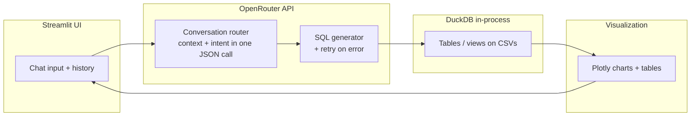

IMPORTANT NOTE --  BEOFRE RUNNING THE PROJECT . PLEASE USE API KEY OF YOURS AND RUN
I AM PASTING THE .env formate please follow that

OPENROUTER_API_KEY=sk-or-v1-.....
OPENROUTER_MODEL=anthropic/claude-sonnet-4.5

IMPORTANT NOTE 2-  So there are total 6 CSV , since it's Huge we can push to the Git, so just download the files and add those files in data folder and you can run the Whole project

# Conversational BI Agent — Instacart Dataset

Plain-English questions → merged context + intent → **DuckDB SQL** → **Plotly** charts in a **Streamlit** chat UI.  
LLM: **OpenRouter** (default: Claude Sonnet-class models). Data: **6 Instacart CSVs** (~3.4M orders, ~32M order-line rows in prior).

---

## How to run

### Prerequisites

- Python **3.10+**
- [OpenRouter](https://openrouter.ai/) API key (Claude or another chat model)

### 1. Clone or unzip the project

```bash
cd bi_agent
```

### 2. Python environment

```bash
python -m venv .venv
.venv\Scripts\activate          # Windows
# source .venv/bin/activate     # macOS/Linux

pip install -r requirements.txt
```

### 3. Data files

Download the Instacart market basket dataset (e.g. [Kaggle](https://www.kaggle.com/datasets/psparks/instacart-market-basket-analysis)) and place **all 6 CSVs** in `bi_agent/data/`:

| File | Role |
|------|------|
| `orders.csv` | Orders |
| `order_products__prior.csv` | Order–product lines (largest) |
| `order_products__train.csv` | Train split lines |
| `products.csv` | Product catalog |
| `aisles.csv`, `departments.csv` | Lookups |

### 4. Configure the LLM

Create `bi_agent/.env` (never commit real keys):

```env
OPENROUTER_API_KEY=sk-or-v1-your-key-here
OPENROUTER_MODEL=anthropic/claude-sonnet-4.5
```

Optional:

```env
BI_AGENT_MATERIALIZE_LARGE=false
```

- `false` (default): large fact tables register as **lazy views** over CSV (fast startup).
- `true`: **full materialized tables** — slower startup, sometimes faster queries, more RAM.

### 5. Start the app

```bash
cd bi_agent
python -m streamlit run app.py
```

Open **http://localhost:8501** (use `python -m streamlit` on Windows if `streamlit` is not on `PATH`).

---

## Architecture overview

### High-level flow



### Request pipeline (detail)

1. **Conversation router** (single LLM call): merge follow-ups (“department” after a vague question) + classify intent (`data_query`, `greeting`, `clarification_needed`, …) + suggest tables and chart type. *Legacy fallback: separate context + intent agents if JSON fails.*
2. **Routing**: greetings / definitions / out-of-scope / clarification short-circuit without SQL.
3. **SQL generator**: schema-grounded DuckDB SQL; **retries** with error text if execution fails; small **exact-match cache** of prior successful query→SQL pairs.
4. **DuckDB**: `execute_raw` / `execute` on an in-memory database; large CSVs default to **views** for startup speed.
5. **Visualization**: pick bar/line/pie/scatter/table/number from result shape + query wording; fix aggregate **numpy** display for single-value results.

### Main modules

| Path | Responsibility |
|------|----------------|
| `app.py` | Streamlit chat UI, startup load |
| `agents/orchestrator.py` | End-to-end pipeline |
| `agents/conversation_router.py` | Combined context + intent |
| `agents/context_analyzer.py`, `intent_classifier.py` | Fallback / legacy |
| `agents/sql_generator.py` | NL → SQL + retries |
| `utils/data_loader.py` | DuckDB, CSV registration, lazy vs materialize |
| `utils/llm_client.py` | OpenRouter HTTP client |
| `utils/visualization.py` | Plotly + insight text |

---

## Key design decisions (and why)

| Decision | Rationale |
|----------|-----------|
| **DuckDB** over loading everything in pandas | **~32M rows** in `order_products__prior`; columnar engine + SQL joins scale; CSV can stay on disk behind views. |
| **Lazy views** for large tables | **Startup in seconds** instead of long full ingests; optional `BI_AGENT_MATERIALIZE_LARGE` for power users. |
| **OpenRouter** (not local Ollama only) | Predictable latency on hosted GPUs; one API for multiple models; `.env`-driven. |
| **One combined LLM step** for context + intent | Cuts **one round trip** per question vs separate context + intent calls (latency and cost). |
| **Separate SQL agent** | Keeps prompts focused; schema injection stays large only for the SQL step; retries isolate execution errors. |
| **No LangChain** | Fewer layers; direct control over prompts and JSON contracts for grading and debugging. |
| **Streamlit `chat_message` / `chat_input`** | Familiar chat UX; input clears after send. |
| **Performance hints in SQL prompt** | Pair/basket queries need **sampling** + DuckDB **`MATERIALIZED`** CTEs so self-joins don’t see inconsistent samples (otherwise **0 rows**). |

---

## Known limitations and failure modes

| Area | Limitation | What happens |
|------|------------|--------------|
| **LLM** | Wrong column name, bad join, hallucinated table | SQL execution error → **retry** with error message; may still fail after retries. |
| **Huge exploratory SQL** | Full scan or explosive join on 32M rows | **Slow or hung** until timeout/OS kill; prompts push sampling + `LIMIT` + `MATERIALIZED` but cannot guarantee. |
| **Pair / market-basket analysis** | Uses **sampled orders** | **Counts are for the sample**, not exact global co-occurrence totals; ranking is still useful. |
| **DuckDB + `USING SAMPLE` + self-join** | Non-materialized sampled CTEs can re-sample | Was causing **empty results**; mitigated by documenting **`AS MATERIALIZED`** on sampled CTEs. |
| **Clarification loop** | Ambiguous questions | Bot may ask a follow-up; short replies need **thread state** (`last_query` + merged query). |
| **Aggregate display** | Single-row `COUNT(*)` results | Previously confused with “1 row in table”; fixed by formatting **numpy** scalars and clearer copy. |
| **Secrets** | `.env` in repo | Use `.gitignore` on `.env`; rotate keys if leaked. |
| **Streamlit shutdown (Windows)** | Ctrl+C sometimes prints asyncio **“Event loop is closed”** | Harmless teardown noise; not an application logic failure. |

---

